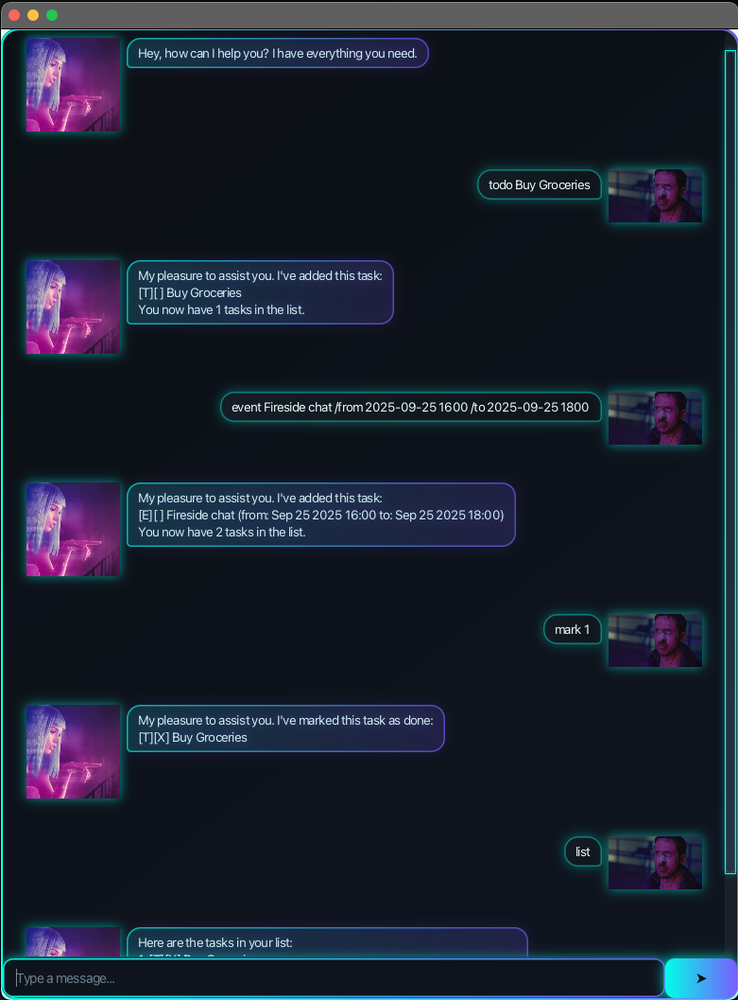

# John User Guide



**John** is a friendly task management chatbot that helps you organize your todos, deadlines, and events through a simple chat interface. If you can type fast, John can help you manage your tasks more efficiently than traditional task management apps.

## Quick Start

1. Ensure you have Java 17 or above installed on your computer.
2. Download the latest `john.jar` file from the releases page.
3. Double-click the jar file to run John, or run `java -jar john.jar` in your terminal.
4. A chat window will appear where you can start typing commands.
5. Type a command and press Enter to execute it.

Some example commands to try:
- `list` : Shows all your tasks
- `todo Buy groceries` : Adds a simple task
- `deadline Submit assignment /by 2025-12-25 2359` : Adds a task with a deadline
- `delete 1` : Deletes the first task
- `mark 1` : Marks the first task as done
- `find assignment` : Finds tasks with the keyword "assignment"
- `bye` : Exits the application

## Features

> **📝 Notes about command format:**
> - Words in `UPPER_CASE` are parameters you need to provide
> - Items in square brackets `[like this]` are optional
> - Date formats: `YYYY-MM-DD` (e.g., 2025-12-25) or `DD/MM/YYYY` (e.g., 25/12/2025)
> - Time formats: `HHMM` (e.g., 1430) or `HH:MM` (e.g., 14:30)

### Viewing all tasks: `list`

Shows all your current tasks with their completion status.

**Format:** `list`

**Example:**
```
list
```

**Expected output:**
```
Here are the tasks in your list:
1. [T][ ] Buy groceries
2. [D][ ] Submit assignment (by: Dec 25 2025 23:59)
3. [E][X] Team meeting (from: Dec 20 2025 10:00 to: Dec 20 2025 11:00)
```

### Adding a todo: `todo`

Adds a simple task without any date or time.

**Format:** `todo DESCRIPTION`

**Example:**
```
todo Buy groceries
```

**Expected output:**
```
My pleasure to assist you. I've added this task:
[T][ ] Buy groceries
You now have 1 tasks in the list.
```

### Adding a deadline: `deadline`

Adds a task that needs to be completed by a specific date and time.

**Format:** `deadline DESCRIPTION /by DATE [TIME]`

**Examples:**
```
deadline Submit assignment /by 2025-12-25 2359
deadline Pay bills /by 25/12/2025
deadline Call mom /by 2025-12-20 1800
```

**Expected output:**
```
My pleasure to assist you. I've added this task:
[D][ ] Submit assignment (by: Dec 25 2025 23:59)
You now have 2 tasks in the list.
```

### Adding an event: `event`

Adds a task that happens during a specific time period.

**Format:** `event DESCRIPTION /from START_DATE [TIME] /to END_DATE [TIME]`

**Examples:**
```
event Team meeting /from 2025-12-20 1000 /to 2025-12-20 1100
event Conference /from 20/12/2025 0900 /to 22/12/2025 1700
event Vacation /from 2025-12-25 /to 2025-12-30
```

**Expected output:**
```
My pleasure to assist you. I've added this task:
[E][ ] Team meeting (from: Dec 20 2025 10:00 to: Dec 20 2025 11:00)
You now have 3 tasks in the list.
```

### Marking tasks as done: `mark`

Marks a task as completed.

**Format:** `mark TASK_NUMBER`

**Example:**
```
mark 2
```

**Expected output:**
```
My pleasure to assist you. I've marked this task as done:
[D][X] Submit assignment (by: Dec 25 2025 23:59)
```

### Unmarking tasks: `unmark`

Marks a completed task as not done.

**Format:** `unmark TASK_NUMBER`

**Example:**
```
unmark 2
```

**Expected output:**
```
My pleasure to assist you. I've marked this task as not done yet:
[D][ ] Submit assignment (by: Dec 25 2025 23:59)
```

### Deleting tasks: `delete`

Removes a task from your list permanently.

**Format:** `delete TASK_NUMBER`

**Example:**
```
delete 1
```

**Expected output:**
```
My pleasure to assist you. I've removed this task:
[T][ ] Buy groceries
You now have 2 tasks in the list.
```

### Finding tasks: `find`

Searches for tasks containing a specific keyword.

**Format:** `find KEYWORD`

**Example:**
```
find assignment
```

**Expected output:**
```
Here are the matching tasks in your list:
1. [D][ ] Submit assignment (by: Dec 25 2025 23:59)
2. [D][ ] Math assignment (by: Dec 30 2025 23:59)
```

### Postponing deadlines: `postpone`

Reschedules a deadline task to a new date. Only works with deadline tasks.

**Format:** `postpone TASK_NUMBER /to NEW_DATE [TIME]`

**Example:**
```
postpone 2 /to 2025-12-28 2359
```

**Expected output:**
```
My pleasure to assist you. I've postponed this deadline:
[D][ ] Submit assignment (by: Dec 28 2025 23:59)
Previous date: Dec 25 2025 23:59
New date: 2025-12-28 2359
```

### Exiting the program: `bye`

Closes the John application.

**Format:** `bye`

## Data Storage

John automatically saves your tasks to a file called `john.txt` in the `data` folder. Your tasks will be preserved between sessions, so you don't need to worry about losing your data when you close the application.

## Tips & Tricks

💡 **Quick Tips:**
- Task numbers shown in `list` are used for `mark`, `unmark`, `delete`, and `postpone` commands
- You can use various date formats: `2025-12-25`, `25/12/2025`, or `2025-12-25T23:59`
- Use `find` to quickly locate specific tasks when your list gets long
- Only deadline tasks can be postponed - todos and events cannot be rescheduled

## FAQ

**Q: What happens if I enter an invalid date?**  
A: John will show an error message asking you to use a valid date format.

**Q: Can I edit task descriptions after creating them?**  
A: Currently, you need to delete the old task and create a new one with the updated description.

**Q: What's the difference between a deadline and an event?**  
A: Deadlines have a single due date/time, while events have both start and end times.

## Command Summary

| Action | Format | Example                                                   |
|--------|--------|-----------------------------------------------------------|
| **List tasks** | `list` | `list`                                                    |
| **Add todo** | `todo DESCRIPTION` | `todo Buy milk`                                           |
| **Add deadline** | `deadline DESCRIPTION /by DATE` | `deadline Assignment /by 2025-12-25 2359`                 |
| **Add event** | `event DESCRIPTION /from DATE /to DATE` | `event Meeting /from 2025-12-20 1000 /to 2025-12-20 1100` |
| **Mark done** | `mark NUMBER` | `mark 1`                                                  |
| **Mark undone** | `unmark NUMBER` | `unmark 1`                                                |
| **Delete task** | `delete NUMBER` | `delete 2`                                                |
| **Find tasks** | `find KEYWORD` | `find assignment`                                         |
| **Postpone deadline** | `postpone NUMBER /to DATE` | `postpone 1 /to 2025-12-30`                               |
| **Exit** | `bye` | `bye`                                                     |
